# What's this version?
This is an early-testing version which Kiyofumi Takaba has tested at TEM more than once.

<small>*Last update: 17 Dec 2025*</small>

### TOC
- [Feature list](#Feature-list)
    - [Bottom line indicator](#Bottom-line-indicator)
    - [Visualization Panel](#Visualization-Panel)
    - [File operations](#File-operations)
    - [TEM Ctrls](#TEM-Ctrls)
    - [Postprocess Ctrls](#Postprocess-Ctrls)
    - [Extensions](#Extensions)
    - [Supporting subprograms](#Supporting-subprograms)
- [Setup](#Setup)
- [Code-rebasing log](Steps_KT-codeblend-creation.md)
- [Known/unsolved issues](#Known/unsolved-issues)

### Feature list
#### Bottom line indicator
- No. of ```Spots``` (JFJ), estimated resolution (```d_min```) (JFJ+CPU), pixel-value-range indicator (```value```) (JFJ), and intensity/dose indicator.
- ```exit relay-server```: Stop the relay-server running at TEM on exiting the GUI.

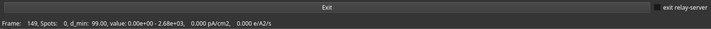

#### Visualization Panel
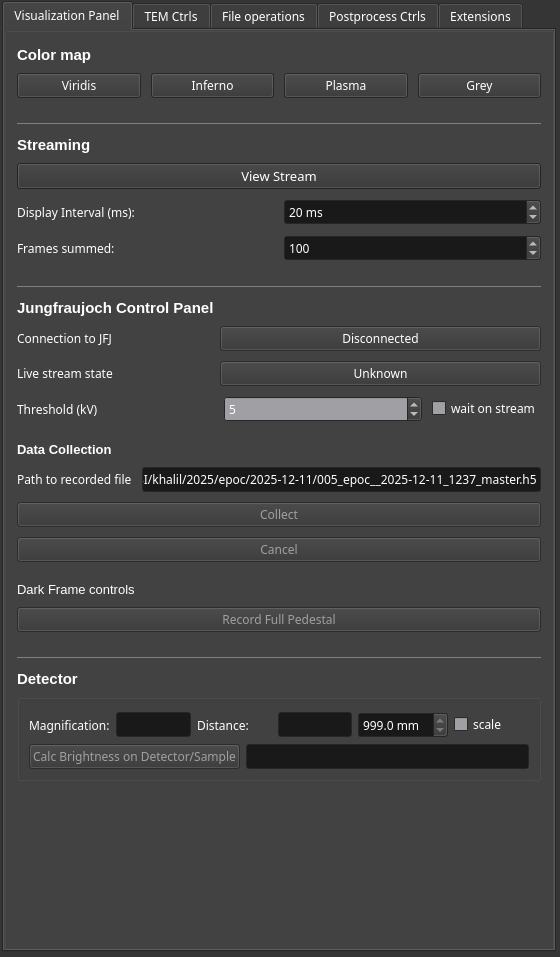

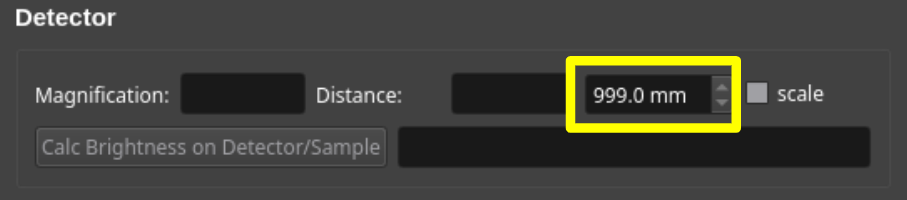

- Calibrated distance display

#### TEM Ctrls
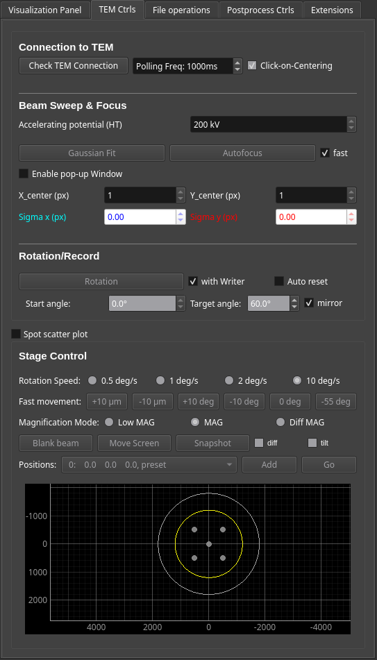

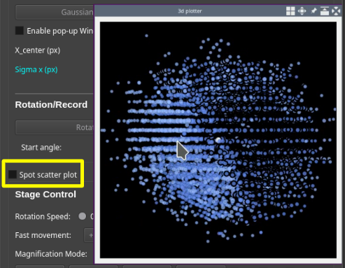

- ```Spot scatter plot```: 3D plotter of spots which is identified by JFJ (FPGA)

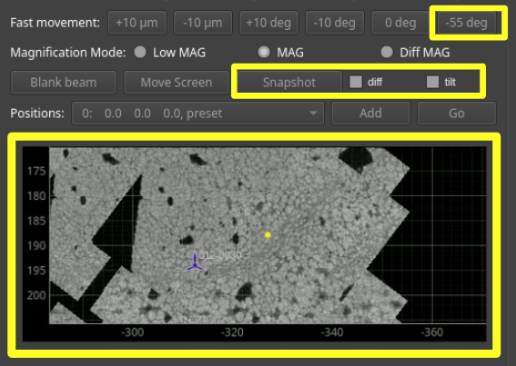

- ```-55 deg```: Larger rotation shortcut.
- **Side-view** of grid atlas  
    This displays layers of grid-atlas. Other than snapshots, images are **automatically** updated and centred. ```Click-on-move``` is available for this view.
    - Two **low-mag image montages** with and without stage tilt
    - Two **estimated resolution dot-plot** with and without stage tilt
    - Buffer layer for **snapshots**
- ```Snapshot```: Hold current frame image in the buffer layer and display in the side-view. Up to 50 frames are allowed for now.
- ```diff```, ```tilt```: Toggle displays of different layers

#### File operations
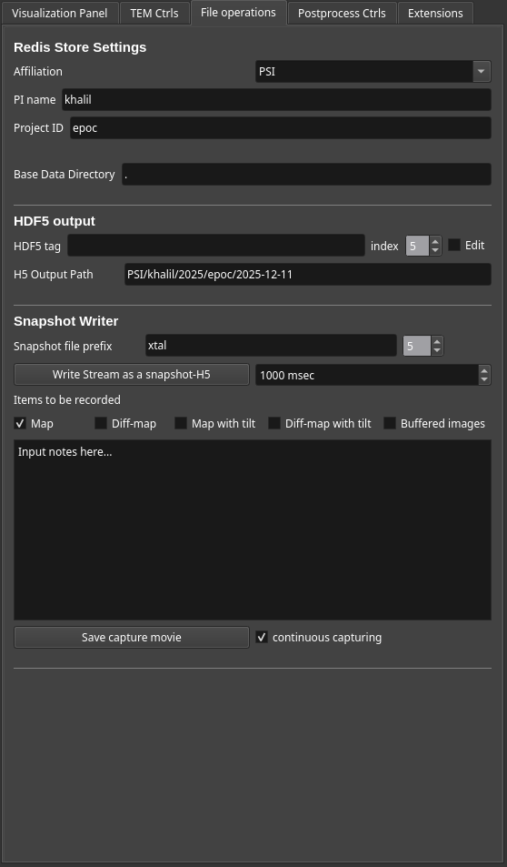

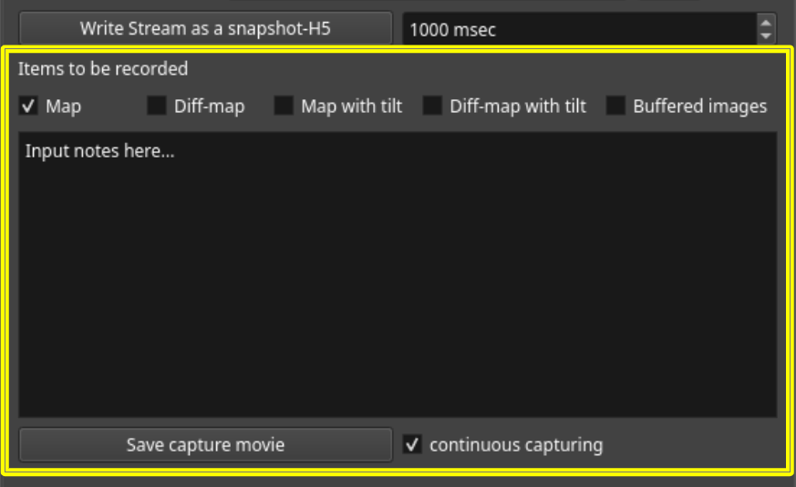

- ```Map```, ```Diff-map```, ```Map with tilt```, ```Diff-map with tilt```, ```Buffered images```: Checkboxes to save these supporting images within the HDF file.
- **Edit box**: Comment widget for taking notes to be saved in the HDF.
- ```Save capture movie```, ```continuous capturing```: During the checkbox is on, the screen where the GUI is running is always recorded and that for past 60 seconds is holded on the memory. By clicking the save button, the mp4-movie is saved.

#### Postprocess Ctrls
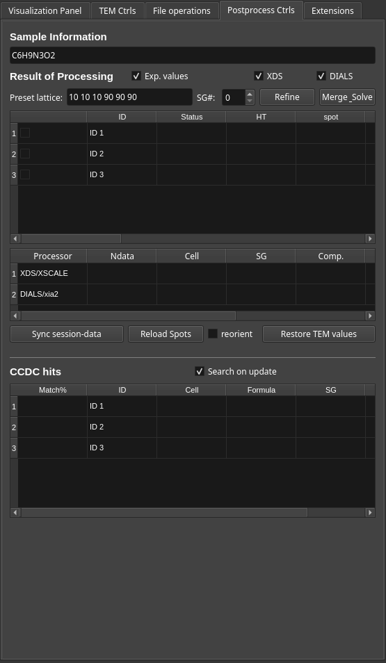

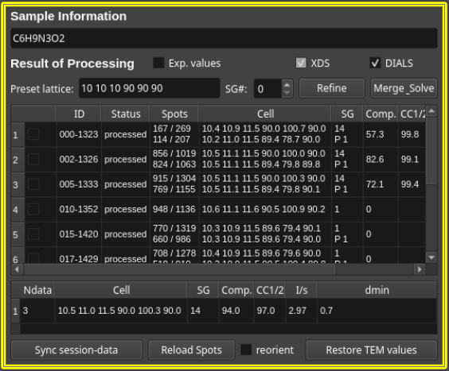

- Formula line edit: Sample formula used for *SHELXT*-phasing
- **Result of Processing**  
    Communicating with *postprocess_server* is necessary.
    - ```Exp. values```: Toggle display of measurement parameters in the table
    - ```XDS```, ```DIALS```: Programs used for refinement and merging-phasing processes. *XDS* works with *XSCALE*, and *DIALS* works with *xia2*. *SHELXT* and *Shelxle* are commonly employed.
    - ```Preset lattice```, ```SG#```: Lattice parameters and Spacegroup ID to be refered in refinement processing
    - ```Refine```, ```Merge_Solve```: Currently, postprocessing on data-collection covers only steps until lattice indexing. These buttons launches further steps for selected datasets with user-defined parameters.
    - Table widget of each dataset: List of measurement parameters and statistics of single datasets. The first column is a selector checkbox.
    - Table widget of merged dataset: List of statistics of merged datasets.
    - ```Sync session-data```: Synchronize (reload) the json session file with the processing server.
    - ```Reload Spots```, ```reorient```: Reload JFJ-identified spots of the recorded data. Spots are displayed in 3D plotter window. The checkbox toggles the display coordinate between lab-based and (determined)lattice-based.
    - ```Restore TEM values```: Apply TEM values of the saved datasets. At the moment, **spot ID**, **Magnification**, **Camera distance**, and **Brightness** are selected to be applied.

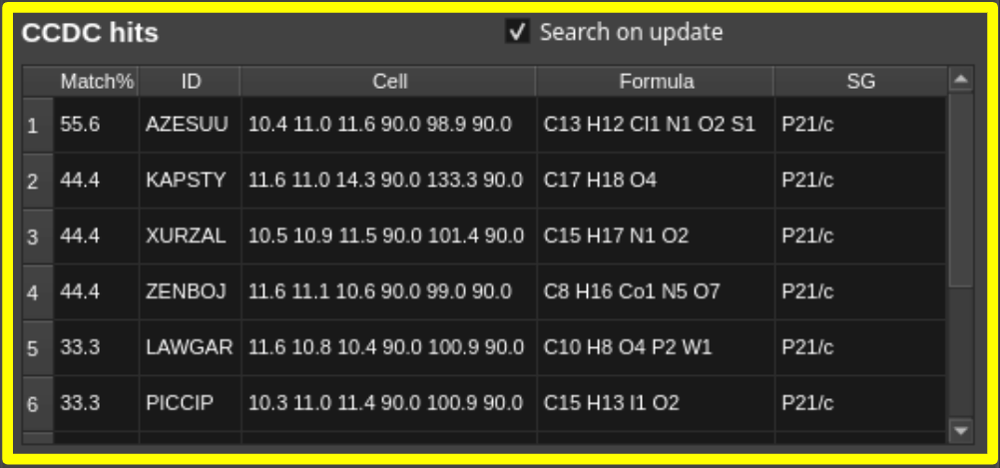

- **CCDC hits**  
    Communicator and hit-indicator with *CCDCscreener*. If *CCDCscreener* is running the same server as *postprocess_server*, the determined lattice paramers are inquired through the CCDC-API, to get if any known structures having the similar lattice can be found in the database. If any entries are hit, they are listed with some parameters. The inquiry is emitted on synchronization if ```Search on update``` is checked.

#### Extensions

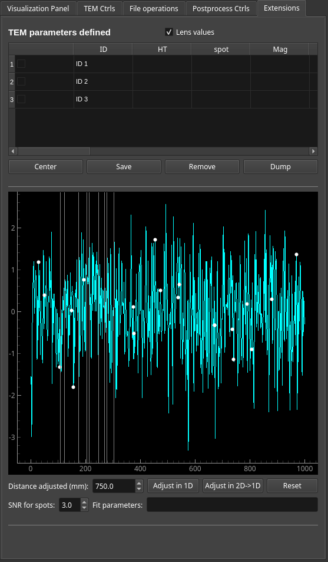

A helper to create a camera-distance calibration table using a powder standard grid (e.g. Aluminium). 

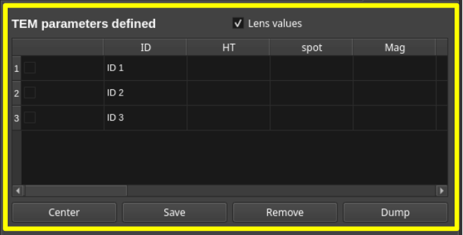

- **TEM parameters defined**
    - ```Lens values```: Toggle display of measurement parameters in the table
    - Table widget of TEM-parameters on measurement: List of TEM parameters with some focusing indices.
    - ```Center```: Automatic direct-beam guidance to the optical origin using PLA deflector. This does **not** work always expectedly, due to the delay of focus-indicator (Gaussian-fitting).
    - ```Save```: Acquire and list the current TEM parameters and focusing indices.
    - ```Remove```: Remove dataset values selected with the checkbox column (for re-recording)
    - ```Dump```: Dump the saved value list as a json file, which is formatted to be used as an updated version [calibration table](../jungfrau_gui/ui_components/tem_controls/toolbox/TEMvalues_20250813-141442.json).

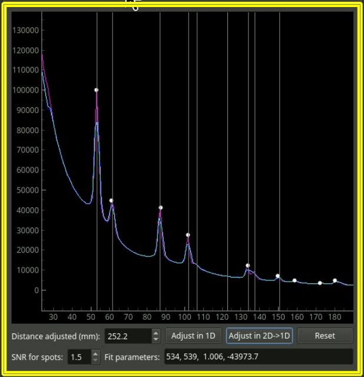

- Radial integration plotter: Plot the radial integration of the acquired image. As the integration runs under CPU, 20 summed-frames are used for integration (i.e. 1 second average for the usual case). To avoid interrupting other GUI function, this integration runs only when this panel is active.
- ```Distance adjusted (mm)```: Display the current value of calibrated distance. This is **not** automatically updated.

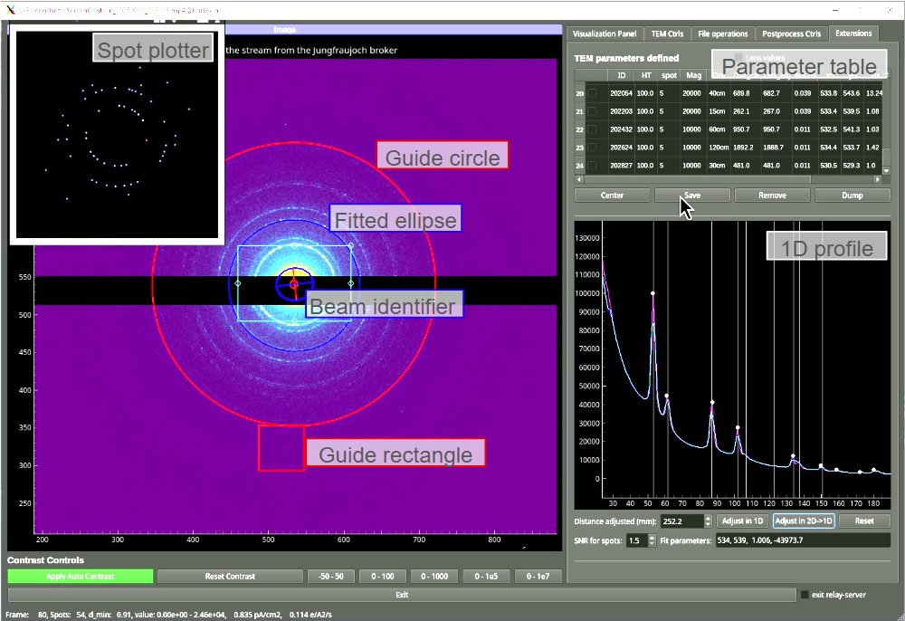

- ```Adjust in 1D```, ```Adjust in 2D -> 1D```: On clicking these buttons, the peaks in the radial integration plot (while dots) are identified, and the camera distance is calculated as the peak positions match as exectedly (gray vertical lines). The ```Adjust in 2D -> 1D``` button identifies the ellipticity of ring pattern using identified spots (by JFJ) and elliptical fitting (on CPU), applies it for radial integration, and then calculate camera distance.
- ```Reset```: Reload the (past) configurated camera distance as the initial value.
- ```SNR for spots```: SNR control for spot-finding
- ```Fit parameters```: Display of beam center (xy), ellipticity, and axis. The axis does not have any meaning for now.

#### Supporting subprograms
- ```Metadata updater```: To dedicate on metadata-description, postprocessing-part has been separated.
- ```PostprocessServer_JFED```: Separated server dedicated on postprocessing. https://github.com/epoc-ed/PostprocessServer_JFED
- ```CCDCscreener```: Quick-check of CCDC entries matching specified parameters. https://github.com/epoc-ed/CCDCscreener
- ```ShelXFile_EDiSFAC```: Quick-application of iSFAC modeling. https://github.com/epoc-ed/ShelXFile_EDiSFAC

### Setup
To activate **3d-scatter plot**, *vispy* needs to be installed in the python environment for the GUI (using ```3dvis.yaml```). **Screen capturer** runs with a separated script, which GUI just calls. This requires installation of *mss* (and *opencv*) to the python environment (using ```capturer/mss-capture.yaml```). Coexistence of *vispy*, *mss* and other packages for GUI has not been tested.

- Launching GUI (jem2100plus@hodgkin, CCSA-UniVie):
```
conda run -n dev_3dvis python launch_gui.py -e
```

Because *dxtbx* under python 3.11 had a **conflict** with *ccdc python api*, *PostprocessServer_JFED* and *CCDCscreener* needed to run under independent python environments. Not to introduce excess complexity to the common-use path (noether), these programs has been developed using the different server (gauss), where creating a local enviroment is permitted. The only script within this GUI repository is ```metadata_update_server.py```, which should be placed at the data-server (noether) for now.

- Launching metadata-updater (jem2100plus@noether, CCSA-UniVie):
```
python -i metadata_update_server.py
```

### Known/unsolved issues
- ```Save capture movie``` does not include mouse cursor in recording due to an error of *mss*.